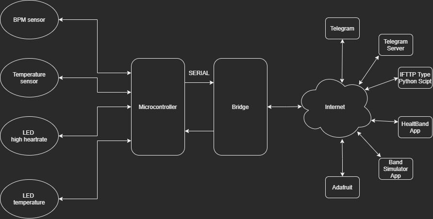
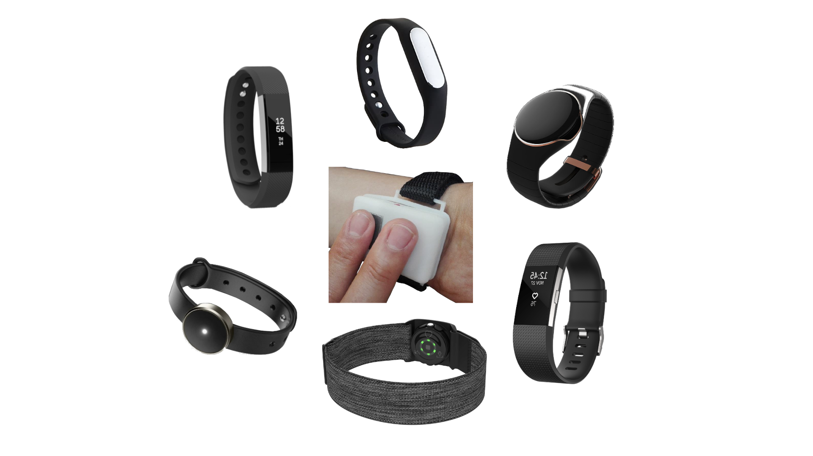

# IOT HEALTHBAND

IOT HEALTHBAND is an innovative project aimed at developing a prototype of a wearable band for continuous monitoring of vital parameters, specifically designed for at-risk individuals such as unaccompanied elderly or people with bad cardiac conditions.

*Figure 1: Modules and sub-modules of the project architecture*

## Project Objective

The main objective of IOT HEALTHBAND is to provide an effective tool for "supervising" the health of loved ones, particularly those considered at-risk. This project stems from the awareness that cardiovascular diseases represent one of the leading causes of death in Italy, and aims to offer a technological solution for constant monitoring and prevention.

## Key Features

1. **Continuous Monitoring**: The band constantly records vital parameters such as heart rate and body temperature.

2. **Location Tracking**: Keeps track of the user's movements, allowing monitoring of any departures from home.

3. **Data Sharing**: Through a Telegram bot, collected data can be shared with family members or caregivers.

4. **Real-Time Notifications**: The system sends automatic alerts in case of:
   - Abnormal vital parameter values
   - Leaving the residential area (Look at Figure 2)
   - Entering potentially risky areas*

5. **Data History**: Ability to view trends in vital parameters over time, useful for identifying recurring trends or anomalies.

*Fugure 2: Example of automatic alert*

## Project Development

The project has been articulated in two main phases:

1. **Hardware Design**: Development of the physical prototype of the band, integrating the necessary sensors for vital parameter detection and location tracking.

2. **Software Development**: Creation of a system for managing and processing data collected from sensors, implementation of the Telegram bot for communication and information sharing.

## Telegram Bot Functionality

The Telegram bot offers various features accessible through specific commands:

- `/start`: Welcome message
- `/help`: List of available commands
- `/getBpm` and `/getTemperature`: Display of current heart rate and temperature values
- `/getParameters`: Display of all vital parameters
- `/getCurrAddress`: Display of the user's last known location

## Advantages of IOT HEALTHBAND

1. **Prevention and Timely Intervention**: Allows early detection of anomalies in vital parameters, enabling timely interventions.

2. **Market Uniqueness**: Offers a unique combination of vital parameter monitoring and simplified information sharing.

3. **Ease of Use**: Uses a familiar interface (Telegram) for communication and data management.

4. **Peace of Mind for Caregivers**: Reduces concerns for family members or caregivers by providing constant and reliable monitoring.

5. **Anti-Covid Functionality**: Includes an alert system for potential exposures to risk areas*, particularly useful during pandemics such as COVID-19.

## Future Developments

The project envisions further developments to improve and expand the prototype's functionalities, with the aim of making it even more effective and user-friendly both for phisical and software part.

*Figure 3: Set of the proposed IOT HEALTHBAND prototype design*

IOT HEALTHBAND represents a significant step towards a proactive approach to health, combining wearable technology, Internet of Things, and real-time communication to improve the quality of life and safety of at-risk individuals.

---
*risk area: The band is considered to be inside a "risk area" if another HealBand nearby registers an abnormal body temperature.
